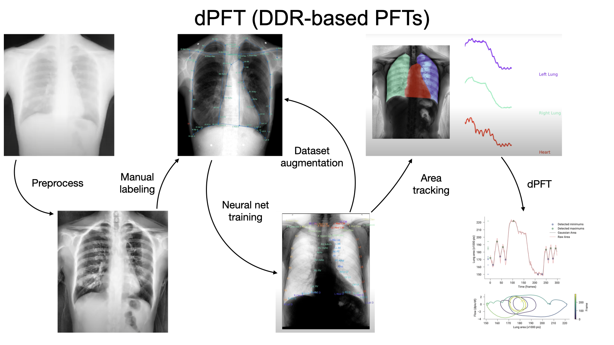

# dPFT (DDR-based Pulmonary Function Test)

dPFT ([Santibanez, V., Pisano, T.J., et al. 2023](https:....)) are generated using an automated lung analysis pipeline that takes raw dynamic digital radiography (DDR) videos and outputs virtual pulmonary function test (PFT) data. This is accomplished using convolutional neural networks for serial anatomical detection across frames.

An overview of dPFT is shown here:

# (please note that upon publication the following resources will become available)

## Installation
Please see [INSTALLATION.md](INSTALLATION.md) for installation instructions.

## Example use cases and tutorials
Please see [EXAMPLES.md](EXAMPLES.md) for basic dPFT use case.

Demonstration datasets can be found [here](https:....).
